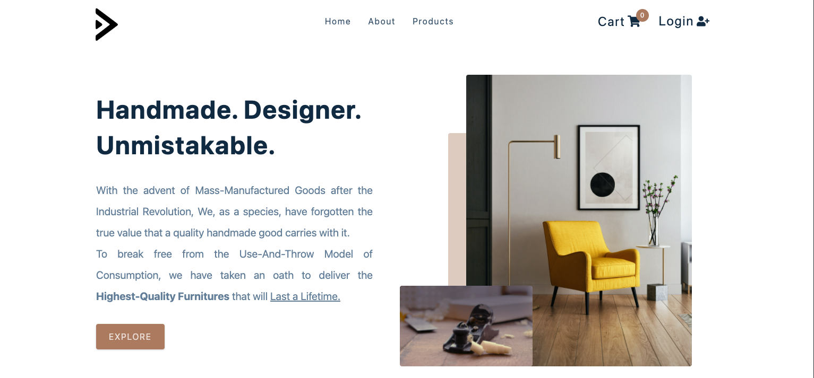

<h1 align="center"> <b>HYPE. The Furniture Store.</b> </h1>



<p align="center">
  <a href="https://github.com/docflex" target="_blank">
    
  </a>
    
  <a href="https://hype-the-furniture-store.netlify.app/" target="_blank">
    
  </a>
</p>

---

<b>HYPE</b> is the result of my love for high-end furnitures, modern design, and the art of Web Development. The purpose of this project was to push the limits of my understanding of the <b>React Framework and library.</b> It stands as an ode to <u>Minimal and Material Design</u>.

This repository contains all necessary information about the development of this project, how you can run it natively from your system, and what all can be improved in the future versions of this project.

---

<h2 align="center"><b>Technologies and APIs</b></h2>
<br>
<p align="center">
    <a href="https://github.com/facebook/react/blob/main/CHANGELOG.md#1702-march-22-2021" target="_blank">
        
    </a>
    <a href="https://github.com/nodejs/node/blob/master/doc/changelogs/CHANGELOG_V16.md#16.14.0" target="_blank">
        
    </a>
    <a href="https://auth0.com/releases/2202" target="_blank">
        
    </a>
    <a href="https://stripe.com/docs/upgrades#api-changelog" target="_blank">
        
    </a>
    <a href="https://docs.netlify.com/cli/get-started/" target="_blank">
        
    </a>
</p>

---

<h2 align="center"><b>Hosting Status</b></h2>

[](https://app.netlify.com/sites/hype-the-furniture-store/deploys)


<!-- ## How To Run The Programs:

> Clone the Repository <br/>
> Link: https://github.com/ACM-VIT/Reverse-Coding-2022-Solutions
>
> -   Step 1: Navigate to the required Round Folder. Then Run the Following Command. This Compiles the Code
>
> ```shell
>    $ g++ <Code-File-Name>.cpp -o runCode
> ```
>
> -   Step 2: Next Use this Code to Run The Program.
>
> ```shell
>    $ ./runCode
> ```
>
> -   Step 3: Put in your Input to Test the IO.
>
> ```shell
>    $ <Put Your Input>
> ```
>
> _Run_ the program according to **Constraints**.

<h2 align="left" > Authors </h2>

1. [Rehber Moin](https://github.com/docflex)
2. [Aryaman Kolhe](https://github.com/Chasmiccoder)
3. Jay Kaoshik
4. [Rishu Yadav](https://github.com/rishuyadav)

<h2 align="left" > Contributors </h2>

1. [Gagan Malvi](https://github.com/gaganmalvi)
2. [Harsh Avinash](https://github.com/Harsh-Avinash) -->
